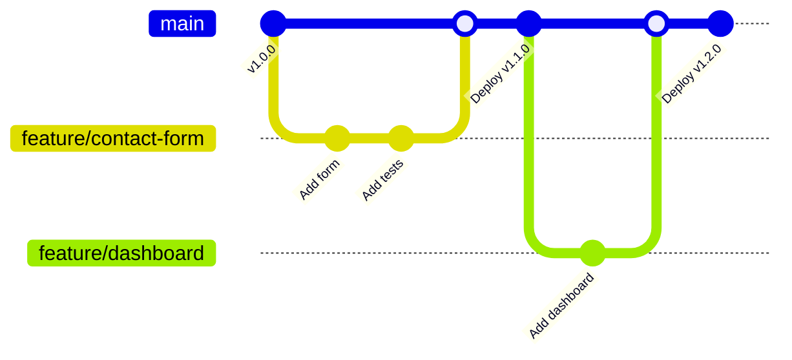
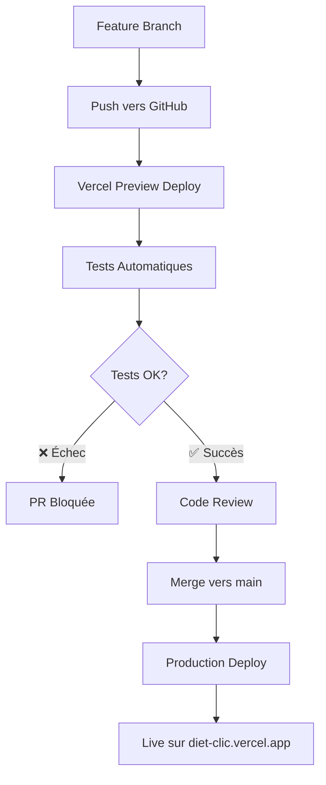

# Diet-Clic - Application Web pour Diététicienne Nutritionniste

> **BLOC 2 : CONCEVOIR ET DÉVELOPPER DES APPLICATIONS LOGICIELLES**

Une application web moderne développée avec Next.js 15, React 19, TypeScript et PostgreSQL, déployée sur Vercel.

**🌐 URL Production :** [https://diet-clic.vercel.app](https://diet-clic.vercel.app)

---

## 📋 Sommaire

- [🏗️ Architecture et Technologies](#️-architecture-et-technologies)
- [🚀 GitHub Flow et Déploiement](#-github-flow-et-déploiement)
  - [C2.1.1 - Stratégie GitHub Flow](#c211---stratégie-github-flow)
  - [C2.1.2 - Système d'Intégration Continue](#c212---système-dintégration-continue)
- [🎯 Conception et Développement](#-conception-et-développement)
  - [C2.2.1 - Prototype de l'Application](#c221---prototype-de-lapplication)
  - [C2.2.2 - Harnais de Test Unitaire](#c222---harnais-de-test-unitaire)
  - [C2.2.3 - Évolutivité et Sécurisation](#c223---évolutivité-et-sécurisation)
  - [C2.2.4 - Déploiement Continu](#c224---déploiement-continu)
- [🔍 Tests et Qualité](#-tests-et-qualité)
  - [C2.3.1 - Cahier de Recettes](#c231---cahier-de-recettes)
  - [C2.3.2 - Plan de Correction des Bogues](#c232---plan-de-correction-des-bogues)
- [📖 Documentation Technique](#-documentation-technique)
  - [C2.4.1 - Documentation d'Exploitation](#c241---documentation-dexploitation)
- [🔗 Liens Utiles](#-liens-utiles)

---

## 🏗️ Architecture et Technologies

### Stack Technique

- **Frontend :** Next.js 15, React 19, TypeScript
- **Backend :** Next.js API Routes, Prisma ORM
- **Base de données :** PostgreSQL
- **Authentification :** Better Auth (OAuth + passkeys)
- **Styling :** Tailwind CSS 4, Radix UI + shadcn/ui
- **Tests :** Jest + React Testing Library
- **Déploiement :** Vercel avec CI/CD intégré

### Architecture Domain-Driven Design

```
app/                    # Structure Next.js App Router
├── (public)/          # Routes publiques
├── (protected)/       # Routes protégées
├── api/               # Routes API
└── auth/              # Pages d'authentification

domains/               # Logique métier par domaine
├── auth/
│   └── features/
│       └── login/
└── contact/
    └── features/

shared/                # Code partagé
├── components/        # Composants réutilisables
├── actions/          # Server Actions
├── hooks/            # Hooks React personnalisés
├── utils/            # Utilitaires
└── schemas/          # Schémas de validation Zod

prisma/               # Configuration base de données
```

---

## 🚀 GitHub Flow et Déploiement

### C2.1.1 - Stratégie GitHub Flow

#### Le Protocole de Déploiement Continu

Le protocole suit 5 étapes automatisées :

1. **Build** : Compilation TypeScript vers JavaScript optimisé
2. **Tests unitaires** : Exécution automatique avec Jest (couverture ≥ 80%)
3. **Vérification qualité** : Analyse ESLint (zéro erreur tolérée)
4. **Déploiement** : Push automatique vers l'environnement cible
5. **Migrations** : Application automatique des migrations de base de données

#### Stratégie GitHub Flow

**Approche simplifiée :** Une seule branche principale `main` avec des branches feature temporaires.

| Environnement  | Branche    | Déploiement           | Usage               |
| -------------- | ---------- | --------------------- | ------------------- |
| **Production** | `main`     | Automatique sur merge | Environnement live  |
| **Feature**    | Temporaire | Tests en PR           | Développement isolé |

**Avantages GitHub Flow :**

- ✅ Simplicité maximale
- ✅ Déploiement continu rapide
- ✅ Moins de branches à maintenir
- ✅ Feedback immédiat en production

#### Configuration Vercel - GitHub Flow

**Project Setup :**

- **Production** : Branche `main` → déploiement automatique
- **Preview** : Toutes les branches feature → déploiements de preview

```bash
# Commande de build pour toutes les branches
buildCommand: "npm run test:coverage && npm run lint && npm run build"
```

**Avantages GitHub Flow + Vercel :**

- ✅ Déploiement production sur chaque merge vers main
- ✅ Preview deployments pour tester les PR
- ✅ Blocage automatique si tests échouent
- ✅ Rollback facile vers commit précédent
- ✅ Feedback immédiat sur erreurs

#### Outils de Monitoring

- **Jest** : Couverture tests (seuil 80%)
- **ESLint** : Analyse statique (zéro erreur)
- **Lighthouse CI** : Audit performances (score ≥ 90)
- **Vercel Analytics** : Core Web Vitals production
- **npm audit** : Vérification vulnérabilités

#### Critères de Performance

| Métrique       | Objectif | Description                                     |
| -------------- | -------- | ----------------------------------------------- |
| **LCP**        | < 2,5s   | Largest Contentful Paint                        |
| **FID**        | < 100ms  | First Input Delay                               |
| **CLS**        | < 0,1    | Cumulative Layout Shift                         |
| **Lighthouse** | ≥ 90     | Performance, Accessibility, Best Practices, SEO |

#### Critères de Qualité du Code

- ✅ **TypeScript** : Mode strict, zéro erreur
- ✅ **ESLint** : Configuration Next.js
- ✅ **Tests** : Couverture minimum 80%
- ✅ **Architecture** : Domain-Driven Design

### C2.1.2 - Système d'Intégration Continue

#### Séquences d'Intégration

**Solution Actuelle - Vercel :**

```bash
npm run test:coverage && npm run lint && npm run build
```

**Alternative GitHub Actions :**

- Tests sur chaque push
- Pipeline CI/CD sophistiqué
- Mais complexité supplémentaire

#### Workflow GitHub Flow Détaillé

**Principe :** Toutes les fonctionnalités partent de `main` et y retournent directement.



**Commandes Pratiques :**

```bash
# 1. Créer une nouvelle fonctionnalité
git checkout main
git pull origin main
git checkout -b feature/nouvelle-fonctionnalite

# 2. Développer et tester
git add .
git commit -m "feat: ajout nouvelle fonctionnalité"
git push -u origin feature/nouvelle-fonctionnalite

# 3. Créer Pull Request sur GitHub (feature → main)
# 4. Après merge automatique, nettoyer
git checkout main
git pull origin main
git branch -d feature/nouvelle-fonctionnalite
```

#### Processus GitHub Flow

1. **Branche feature** : Créer depuis `main` → `feature/nom-de-la-fonctionnalité`
2. **Développement** : Commits réguliers sur la branche feature
3. **Pull Request** : Ouvrir PR vers `main` avec code review obligatoire
4. **Tests automatiques** : Validation CI/CD (Jest + ESLint + Build)
5. **Merge vers main** : Déploiement automatique en production
6. **Nettoyage** : Suppression automatique de la branche feature

#### Guide Pratique GitHub Flow

**🚀 Workflow Quotidien :**

```bash
# ═══════════════════════════════════════════════════════
# 1. NOUVELLE FONCTIONNALITÉ
# ═══════════════════════════════════════════════════════

# Partir toujours de main à jour
git checkout main
git pull origin main

# Créer la branche feature
git checkout -b feature/contact-validation
# ou: git checkout -b hotfix/urgent-bug
# ou: git checkout -b docs/update-readme

# ═══════════════════════════════════════════════════════
# 2. DÉVELOPPEMENT
# ═══════════════════════════════════════════════════════

# Travailler normalement
# ... faire les modifications ...

# Commits réguliers avec messages clairs
git add .
git commit -m "feat: add email validation to contact form"

# Pousser régulièrement (sauvegarde)
git push -u origin feature/contact-validation

# ═══════════════════════════════════════════════════════
# 3. PULL REQUEST
# ═══════════════════════════════════════════════════════

# Sur GitHub : Créer PR feature/contact-validation → main
# - Description claire des changements
# - Screenshots si interface utilisateur
# - Mention des tests ajoutés

# ═══════════════════════════════════════════════════════
# 4. APRÈS MERGE (automatique)
# ═══════════════════════════════════════════════════════

# Revenir sur main et nettoyer
git checkout main
git pull origin main
git branch -d feature/contact-validation

# La fonctionnalité est maintenant LIVE en production ! 🎉
```

**🔧 Cas Spéciaux :**

```bash
# HOTFIX URGENT (même processus, branche différente)
git checkout main
git pull origin main
git checkout -b hotfix/security-patch
# ... fix ...
git commit -m "fix: patch critical security vulnerability"
git push -u origin hotfix/security-patch
# → PR immédiate vers main

# PLUSIEURS COMMITS SUR UNE FEATURE
git checkout feature/dashboard
git add components/
git commit -m "feat: add dashboard layout"
git add api/
git commit -m "feat: add dashboard API endpoints"
git add tests/
git commit -m "test: add dashboard component tests"
git push origin feature/dashboard
# → Une seule PR avec tous les commits

# MISE À JOUR DEPUIS MAIN (si feature longue)
git checkout feature/long-feature
git merge main  # ou git rebase main
git push origin feature/long-feature
```

**✅ Avantages de cette Approche :**

- **Simplicité maximale** : Une seule branche principale
- **Déploiement continu** : Chaque merge = nouvelle version en production
- **Feedback rapide** : Les utilisateurs voient les changements immédiatement
- **Moins de conflits** : Branches feature courtes et fréquentes
- **Preview deployments** : Tester chaque PR avant merge
- **Rollback facile** : `git revert` sur main si problème

#### Configuration Vercel pour GitHub Flow

**🎯 Setup Recommandé :**

1. **Production Project :**

   - **Nom :** `diet-clic`
   - **Branche :** `main` uniquement
   - **Auto-deploy :** ✅ Activé
   - **Preview :** ✅ Pour toutes les branches

2. **Build Settings :**

   ```bash
   # Build Command (avec validation complète)
   npm run test:coverage && npm run lint && npm run build

   # Install Command
   npm ci

   # Output Directory
   .next
   ```

3. **Environment Variables :**
   - Identiques pour production et preview
   - Variables sensibles dans Vercel Dashboard
   - `.env.example` pour la documentation

**🚦 Workflow Automatique :**



**⚡ Résultat :**

- Chaque PR = URL de preview pour tester
- Chaque merge vers main = déploiement production automatique
- Tests bloquent les déploiements défaillants
- Rollback instantané si problème

---

## 🎯 Conception et Développement

### C2.2.1 - Prototype de l'Application

#### Description Générale

Diet-Clic est une application web spécialisée pour diététicienne nutritionniste, offrant une présence en ligne professionnelle avec gestion des demandes de contact.

#### Fonctionnalités de l'Interface

**Interface Publique :**

- 🏠 Page d'accueil responsive avec hero section
- 📋 Présentation des services et parcours professionnel
- ❓ FAQ interactive avec accordéons
- 📝 Formulaire de contact avec validation temps réel
- 📎 Upload de pièces jointes

**Espace Administration :**

- 🔐 Dashboard sécurisé avec authentification
- 📊 Gestion complète des demandes de contact
- 🔍 Filtres avancés (statut, date)
- 🔎 Recherche par nom ou email

#### Design Responsive

| Écran        | Résolution | Optimisations               |
| ------------ | ---------- | --------------------------- |
| **Mobile**   | ≥ 375px    | Interface tactile optimisée |
| **Tablette** | ≥ 768px    | Navigation adaptée          |
| **Desktop**  | ≤ 1920px+  | Expérience complète         |

#### User Stories Implémentées

- 👤 **Visiteur** : Consulter services et informations détaillées
- 🏥 **Patient potentiel** : Envoyer demande personnalisée avec pièces jointes
- 👨‍💼 **Administrateur** : Gérer toutes les demandes reçues
- ♿ **Utilisateur handicapé** : Navigation clavier complète (WCAG 2.1 AA)

#### Frameworks et Paradigmes

**Frontend :**

- **Next.js 15.4** : App Router, architecture moderne
- **React 19** : Server Components, performances optimisées
- **Tailwind CSS 4** : Design system cohérent
- **Radix UI + shadcn/ui** : Composants accessibles

**Backend :**

- **Prisma ORM** : Gestion type-safe PostgreSQL
- **Better Auth** : Authentification OAuth + passkeys
- **Zod** : Validation TypeScript runtime

**Paradigmes :**

- **Domain-Driven Design** : Organisation par domaines métier
- **Architecture composants** : Modulaire avec props typées
- **Programmation fonctionnelle** : Fonctions pures, immutabilité
- **Sécurité de type** : TypeScript strict + validation runtime

### C2.2.2 - Harnais de Test Unitaire

#### Configuration des Tests

**Stack de Test :**

- **Jest** : Framework de test principal
- **React Testing Library** : Tests composants React
- **jsdom** : Simulation environnement navigateur
- **Services mockés** : Resend, UploadThing isolés

#### Couverture de Tests

**46 tests** couvrent la fonctionnalité contact (cœur métier) :

| Composant                                  | Couverture | Tests           |
| ------------------------------------------ | ---------- | --------------- |
| **Actions (contact.ts)**                   | 89,42%     | Actions serveur |
| **Schemas (contact-schema.ts)**            | 100%       | Validation Zod  |
| **Templates (contact-email-template.tsx)** | 99,44%     | Rendu emails    |

#### Types de Tests

**Tests de Validation :**

```typescript
// Cas valide
const validData = { email: "test@example.com", message: "Hello world" };
// Cas invalide
const invalidData = { email: "invalid-email", message: "Hi" };
```

**Tests d'Actions Serveur :**

- Simulation envoi formulaires
- Vérification emails envoyés
- Validation données correctes

**Tests de Templates :**

- Rendu correct des emails
- Présence de toutes les informations
- Formatage approprié

### C2.2.3 - Évolutivité et Sécurisation

#### Mesures de Sécurité - Protection OWASP Top 10

| Faille                           | Protection  | Implémentation                                 |
| -------------------------------- | ----------- | ---------------------------------------------- |
| **Injection SQL**                | Prisma ORM  | Requêtes préparées + validation Zod            |
| **Authentification défaillante** | Better Auth | Sessions sécurisées + OAuth/passkeys           |
| **Cross-Site Scripting (XSS)**   | React + CSP | Sanitization automatique + headers restrictifs |
| **Protection CSRF**              | Better Auth | Tokens automatiques + headers SameSite         |

#### Headers de Sécurité

```javascript
// next.config.ts
const securityHeaders = [
	{
		key: "X-Content-Type-Options",
		value: "nosniff",
	},
	{
		key: "X-Frame-Options",
		value: "DENY",
	},
	{
		key: "X-XSS-Protection",
		value: "1; mode=block",
	},
	{
		key: "Referrer-Policy",
		value: "strict-origin-when-cross-origin",
	},
];
```

#### Gestion Sécurisée des Secrets

- ✅ Variables d'environnement exclusivement
- ✅ Rotation automatique tokens API
- ✅ Chiffrement données sensibles en BDD
- ✅ Audit régulier dépendances (`npm audit`)

#### Actions pour l'Accessibilité - WCAG 2.1 AA

**Navigation Clavier :**

- ✅ Navigation complète au clavier
- ✅ Indicateurs focus visibles (`focus:ring-2 focus:ring-blue-500`)
- ✅ Attributs ARIA appropriés (`role="navigation"`, `aria-label`)

**Support Lecteurs d'Écran :**

- ✅ Landmarks ARIA avec balises sémantiques
- ✅ Labels explicites (`aria-label`, `aria-describedby`)
- ✅ États dynamiques (`aria-expanded`, `aria-current`)

**Contraste et Lisibilité :**

- ✅ Ratio contraste ≥ 4,5:1
- ✅ Taille police ≥ 16px corps de texte
- ✅ Focus suffisamment visible et contrasté

**Formulaires Accessibles :**

- ✅ Labels associés (`htmlFor`)
- ✅ Descriptions erreur (`aria-describedby`)
- ✅ États avec `aria-invalid`
- ✅ Messages erreur (`role="alert"`)

**Validation Accessibilité :**

- ✅ Tests automatisés axe-core
- ✅ Tests manuels navigation clavier
- ✅ Tests lecteurs d'écran (VoiceOver, NVDA)
- ✅ Score Lighthouse Accessibility > 95

### C2.2.4 - Déploiement Continu

#### Historique des Versions

##### Version 1.0.0 - 15 janvier 2024 (Production)

**Version majeure en production incluant :**

**🏗️ Architecture :**

- Architecture Domain-Driven Design complète
- Frontend Next.js 15 + React 19
- Authentification Better Auth (OAuth Google + passkeys)

**✨ Fonctionnalités :**

- Formulaire contact avec validation Zod
- Dashboard administrateur protégé
- Configuration headers sécurité complète

**🔒 Sécurité :**

- Protection OWASP Top 10
- Conformité WCAG 2.1 AA
- Navigation clavier complète

**🧪 Tests :**

- 46 tests unitaires
- Documentation technique complète

#### Statut Opérationnel Version 1.0.0

**✅ Fonctionnelle :**

- Toutes fonctionnalités principales opérationnelles
- Tests systématiquement passants

**✅ Fiable :**

- Tests automatisés systématiques
- Monitoring actif performances

**✅ Viable :**

- Déployée en production
- Utilisateurs actifs quotidiens

#### Fonctionnalités Opérationnelles

**Interface Publique :**

- Page d'accueil responsive
- Navigation fluide entre sections
- Formulaire contact validation temps réel
- Upload fichiers via UploadThing
- Envoi emails automatique via Resend

**Espace Administration :**

- Authentification sécurisée (email/password + OAuth Google)
- Dashboard avec liste contacts
- Filtres et recherche avancée
- Gestion statuts et réponses

**Infrastructure :**

- Base de données PostgreSQL stable
- Déploiement continu Vercel
- Monitoring performances continu
- Sauvegardes automatiques

#### Métriques de Fiabilité

| Métrique              | Performance                       |
| --------------------- | --------------------------------- |
| **Uptime**            | 99,9% (30 derniers jours)         |
| **Temps de réponse**  | 250ms moyenne                     |
| **Taux d'erreur**     | < 0,1%                            |
| **Tests automatisés** | 46 tests passent systématiquement |

---

## 🔍 Tests et Qualité

### C2.3.1 - Cahier de Recettes

#### Tests Fonctionnels Page d'Accueil

**Test d'Affichage Responsive :**

- **Critères :** Adaptation layout desktop (1920x1080), mobile (375x667), tablette (768x1024)
- **Validation :** Aucun scroll horizontal, police ≥ 16px, éléments cliquables ≥ 44px

**Test de Navigation Principale :**

- **Critères :** Liens d'ancrage vers sections À propos, Prestations, FAQ, Contact
- **Validation :** Animations défilement fluides (< 1 seconde)

#### Tests du Formulaire de Contact

**Validation des Champs :**

| Champ       | Valeur Invalide  | Message Erreur Attendu                            |
| ----------- | ---------------- | ------------------------------------------------- |
| **Nom**     | Vide             | "Le nom et prénom sont requis"                    |
| **Email**   | "email-invalide" | "L'email doit être valide"                        |
| **Message** | < 10 caractères  | "Le message doit contenir au moins 10 caractères" |

**Test d'Envoi Réussi :**

- **Critères :** Tous champs correctement remplis
- **Validation :** Email reçu dans 30 secondes + formulaire réinitialisé

#### Tests de Sécurité OWASP

**Test XSS :**

- **Saisie :** `<script>alert('XSS')</script>`
- **Validation :** Script correctement échappé, ne s'exécute pas

**Test Injection SQL :**

- **Saisie :** `'; DROP TABLE users; --`
- **Validation :** Traité comme chaîne de caractères

**Headers de Sécurité :**

- **Validation :** Présence X-Frame-Options, X-Content-Type-Options, CSP

#### Tests de Performance

- **Audit Lighthouse :** Score performance ≥ 90
- **Core Web Vitals :** LCP < 2,5s, FID < 100ms, CLS < 0,1

#### Critères de Validation Globaux

**✅ Critères d'Acceptation :**

- 100% tests fonctionnels passent
- Aucune vulnérabilité critique
- Score Lighthouse ≥ 90
- Tests accessibilité niveau AA validés

**❌ Critères de Non-Acceptation :**

- Formulaire contact non fonctionnel
- Authentification défaillante
- Faille sécurité critique
- Performance < 70 Lighthouse

### C2.3.2 - Plan de Correction des Bogues

#### Processus d'Identification et Classification

**Workflow d'Identification :**

1. **Création issue GitHub** avec template standardisé
2. **Reproduction** sur environnement de test
3. **Classification automatique** par labels (gravité + type)

#### Système de Priorisation

| Priorité          | Gravité                  | SLA               | Description            |
| ----------------- | ------------------------ | ----------------- | ---------------------- |
| **P0 Critique**   | Application inutilisable | Immédiat          | Correction immédiate   |
| **P1 Majeur**     | Fonctionnalité bloquée   | 24h               | Correction prioritaire |
| **P2 Mineur**     | Gêne utilisateur         | 1 semaine         | Planification normale  |
| **P3 Cosmétique** | Amélioration esthétique  | Prochaine release | Amélioration continue  |

#### Workflow de Correction

1. **Détection** : Création issue avec détails
2. **Assignation** : Attribution développeur
3. **Branche hotfix** : Environnement isolé
4. **Développement** : Correction + tests correspondants
5. **Code review** : Validation par pair
6. **Merge + Déploiement** : Après approbation
7. **Validation** : Tests complets + fermeture issue

#### Template de Rapport de Bogue

```markdown
## Description

[Description claire du problème]

## Étapes de Reproduction

1. [Étape 1]
2. [Étape 2]
3. [Étape 3]

## Comportement Attendu

[Ce qui devrait se passer]

## Comportement Actuel

[Ce qui se passe réellement]

## Environnement

- **Navigateur :** [Chrome 120, Firefox 121, etc.]
- **OS :** [Windows 11, macOS 14, etc.]
- **Version :** [v1.0.0]

## Captures d'écran

[Si nécessaire]
```

#### Analyse d'Amélioration Continue

**Pour chaque bogue corrigé :**

- **Post-mortem :** Identification cause racine
- **Prévention :** Mesures futures
- **Tests manquants :** Identification lacunes
- **Documentation :** Mise à jour si nécessaire

---

## 📖 Documentation Technique

### C2.4.1 - Documentation d'Exploitation

#### Manuel de Déploiement

##### Prérequis Techniques Production

| Composant      | Version Minimum        | Recommandation         |
| -------------- | ---------------------- | ---------------------- |
| **Node.js**    | 18.x LTS               | 20.x LTS               |
| **PostgreSQL** | 14.x                   | 15.x                   |
| **SSL/TLS**    | Let's Encrypt          | Certificat valide      |
| **Ressources** | 2GB RAM, 20GB stockage | 4GB RAM, 50GB stockage |

##### Services Externes Requis

- ✅ **Resend** : Compte vérifié envoi emails
- ✅ **UploadThing** : Gestion uploads fichiers
- ✅ **PostgreSQL** : Base de données accessible production

##### Procédure de Déploiement

**1. Préparation :**

```bash
git clone [repository]
npm ci --production
```

**2. Configuration :**

```bash
# Créer .env.production
DATABASE_URL="postgresql://..."
AUTH_SECRET="..."
AUTH_GOOGLE_ID="..."
AUTH_GOOGLE_SECRET="..."
RESEND_API_KEY="..."
UPLOADTHING_SECRET="..."
UPLOADTHING_APP_ID="..."
NEXT_PUBLIC_URL="https://..."
```

**3. Base de Données :**

```bash
npx prisma generate
npx prisma migrate deploy
npx prisma db pull  # Vérification
```

**4. Build et Démarrage :**

```bash
npm run build
npm run start  # Test local port 3000
```

##### Vérifications Post-Déploiement

- ✅ **HTTPS** : Accès sécurisé fonctionnel
- ✅ **Formulaire contact** : Emails envoyés correctement
- ✅ **Authentification** : Connexion/déconnexion opérationnelle
- ✅ **Base de données** : Temps de réponse acceptables
- ✅ **Uploads** : UploadThing fonctionnel
- ✅ **Performance** : Temps de chargement satisfaisants

#### Manuel d'Utilisation

##### Navigation Visiteurs

**Accès au Site :**

- **URL principale** : Affichage page d'accueil
- **Sections disponibles** : À propos, Prestations, FAQ, Contact

**Utilisation Formulaire Contact :**

- **4 champs obligatoires :** Nom complet, email, sujet, message
- **Pièces jointes :** Jusqu'à 3 fichiers
- **Validation** : Temps réel des champs
- **Confirmation** : Message d'envoi à l'écran

##### Gestion Administrative

**Connexion Espace Administration :**

- **URL :** `/auth/signin`
- **3 options :** Email/password, Google OAuth, passkeys

**Dashboard Principal :**

- Vue d'ensemble statistiques
- Derniers contacts reçus
- Actions rapides (traiter, archiver)

**Gestion des Contacts :**

- Liste complète avec filtres (statut, date)
- Recherche par nom ou email
- Actions : traiter, archiver, répondre, exporter CSV

##### Résolution Problèmes Courants

**Email Non Reçu :**

1. Vérifier dossier spams/indésirables
2. Confirmer adresse email saisie
3. Contacter administrateur si délai > 5 minutes

**Problème Connexion Administration :**

1. Vérifier identifiants
2. Utiliser "Mot de passe oublié"
3. Essayer connexion Google alternative
4. Vider cache navigateur

#### Manuel de Mise à Jour

##### Gestion des Dépendances

**Vérifications Régulières :**

```bash
npm outdated        # Mises à jour disponibles
npm audit          # Vulnérabilités sécurité
```

**Mises à Jour Prudentes :**

```bash
npm update                    # Mises à jour mineures
npm install package@latest    # Mise à jour ciblée
npm test                     # Vérification post-update
```

**Mises à Jour Majeures :**

```bash
npx npm-check-updates -u
npm install
npm run test:coverage
npm run build
```

##### Évolution Base de Données

**Création Migration :**

```bash
# 1. Modifier schéma Prisma
# 2. Générer migration
npx prisma migrate dev --name add_new_feature
# 3. Appliquer en production
npx prisma migrate deploy
```

**Sauvegarde Préventive :**

```bash
pg_dump database_name > backup_$(date +%Y%m%d).sql
```

**Restauration :**

```bash
psql database_name < backup_20240115.sql
```

##### Procédures de Rollback

**Rollback Application :**

```bash
git checkout tags/v1.0.0
npm ci
npm run build
npm restart
```

**Rollback Base de Données :**

```bash
npx prisma migrate resolve --rolled-back migration_name
npx prisma migrate deploy
```

##### Planning de Maintenance Préventive

| Fréquence       | Type                 | Actions                       |
| --------------- | -------------------- | ----------------------------- |
| **Immédiat**    | Sécurité critique    | Patches sécurité              |
| **Mensuel**     | Maintenance courante | Dépendances patches/mineures  |
| **Trimestriel** | Évolution majeure    | Frameworks versions majeures  |
| **Semestriel**  | Optimisation         | Base de données, performances |

**Fenêtre de Maintenance :**

- **Horaire :** Dimanche 2h-4h du matin
- **Notification :** 48h à l'avance
- **Procédure :** Tests feature branch → Sauvegarde → Merge main → Vérification

---

## 🔗 Liens Utiles

- **🌐 Application en ligne :** [https://diet-clic.vercel.app](https://diet-clic.vercel.app)
- **📂 Code source :** [Lien GitHub du projet]
- **📚 Documentation technique :** [Lien vers la documentation]
- **🧪 Tests automatisés :** Intégrés au pipeline CI/CD
- **📊 Monitoring :** Vercel Analytics et Lighthouse CI

---

<div align="center">

**Diet-Clic** - Une application web pour diététicienne nutritionniste

\_Développée avec Next.js 15 + React 19 + TypeScript

</div>
